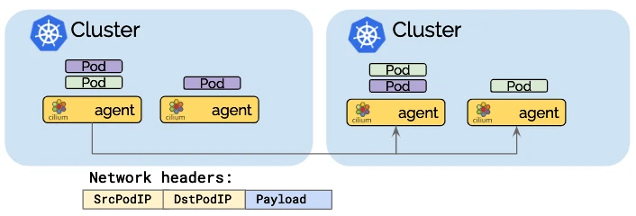
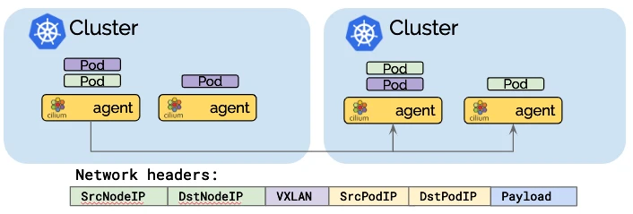
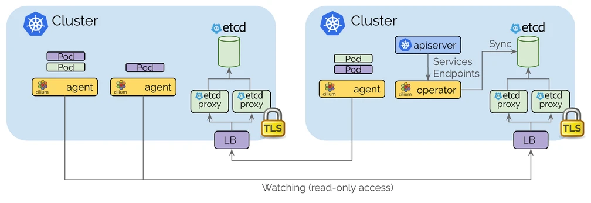
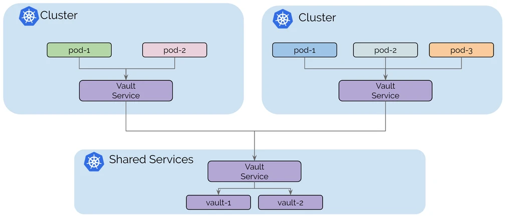
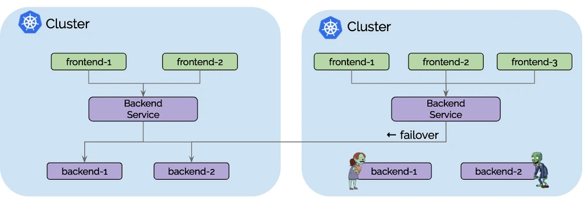
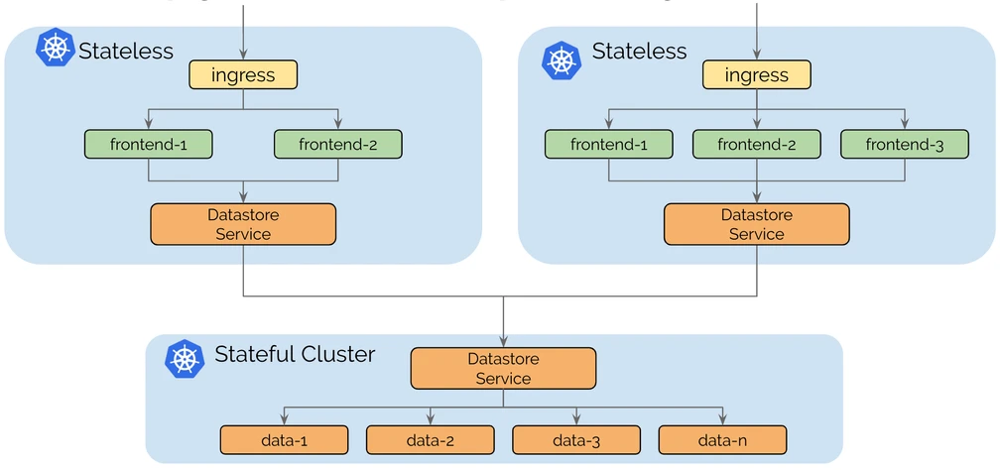

# Cluster Mesh with Cilium Overview

```yaml
Title: Cluster Mesh with Cilium Overview
Author: Mitch Murphy
Date: 2024-09-18
```

---

This will be a series of blog posts, first discussing some high-level background on a few of the technologies used. A future post will detail the technical implementation details for reproducing most of what was covered in a Lunch-N-Learn held on November 19, 2024. This demo session discussed configuring, deploying, testing and demoing Cilium Cluster Mesh. Specifically, we demonstrated the use of global services (and shared ingress) to significantly improve resiliency/availability, as well as splitting out stateless and stateful workloads (in this case observability metrics/logs using LGTM). We will also briefly discuss deploying a lightweight service mesh using Cilium 1.16.1, securing workloads via SPIRE/SPIFFE as well as node encryption via Wireguard.

## Pre-requisites

Before configuring Cilium Cluster Mesh, ensure the following prerequisites are met:

- **Unique CIDR Ranges for Pods and Services**: Each Kubernetes cluster must have unique POD and SERVICES CIDR ranges to avoid conflicts and enable seamless cross-cluster communication via IP addresses.
- **Unique Node CIDRs and IP Connectivity**: Nodes in all clusters must have unique CIDR ranges, and IP connectivity between nodes in different clusters is essential. In my lab environment, I use direct connections between clusters, but per Cilium documentation, it is also possible to achieve connectivity using a VPN or other networking solutions like BGP (Border Gateway Protocol) or VXLAN encapsulation for workloads spread across clouds and regions.
- **Clustermesh API Service Exposure**: Cilium pods need to connect to the Clustermesh API service exposed on each interconnected cluster. While **NodePort** can be used to expose this service, this is not recommended for production environments. Instead, using Kubernetes ingress or **LoadBalancer** services is preferred for production setups to ensure robustness and security. I will be using a **LoadBalancer** service in this demo, and because I am using on-prem hardware this is possible via **MetalLB**. In a future article I plan to replace certain MetalLB functionality with Cilium.
- **Consistent Certificate Authority (CA)**: To configure Cilium Cluster Mesh using the Helm chart without additional manual steps, the Cilium CNI in all clusters must be configured with the same Certificate Authority (CA). This ensures mutual trust between clusters, eliminating the need to manually generate or distribute certificates. This configuration can be specified in the Helm chart values file, allowing for seamless Cluster Mesh setup across clusters. Here, Ansible plays are resposible for creating this CA and "templating" the values file with this information.

### Configuration

- RKE2: v1.31.0
- Cilium: v1.16.1
- Rocky Linux 9.4
- Kernel 6.10.11-1
- 4 vCPU's and 8GB RAM per node
- Currently deployed on Windows Data Center 2022, using:
  - Ansible
  - Packer
- Kuberenetes resources:
  - Helm
  - Kustomize
  - ArgoCD
  - MetalLB
  - NGINX Ingress Controller
  - Prometheus CRDs
  - kube-state-metrics
  - LGTM-distributed stack
  - Grafana Alloy
  - nfs-subdir-external-provisioner

## Cilium Introduction

Cilium is an advanced Container Network Interface (CNI) solution that leverages eBPF (Extended Berkeley Packet Filter), a powerful Linux kernel technology, to provide highly scalable and efficient networking, security, and observability for containerized workloads in Kubernetes.

In Kubernetes, networking is critical because it allows communication between different components like pods, services, and nodes. Traditionally, Kubernetes networking has relied on various CNIs like Flannel, Calico, or Weave to handle the connectivity between pods and services. However, Cilium stands out because it uses eBPF, which allows it to dynamically program the Linux kernel to handle packet filtering, forwarding, and security enforcement at the kernel level, offering several benefits:

1. **Fine-Grained Network Security**: Cilium provides a powerful Network Policy implementation that is capable of enforcing security policies based on the rich context of application-layer metadata. This goes beyond basic IP-based policies, allowing for policies that are aware of protocols, services, and even individual application processes.
2. **Scalable Performance**: Leveraging eBPF, Cilium can deliver networking with significantly lower overhead compared to traditional iptables-based approaches. eBPF runs inside the Linux kernel without needing to go back to user space, ensuring high performance and reduced latency.
3. **Layer 7 Policies and Security**: Cilium supports layer 7 (L7) visibility and filtering, which allows for enforcing security policies based on application-level protocols such as HTTP, gRPC, or Kafka. This is particularly useful in microservices architectures where services are constantly communicating over well-defined APIs.
4. **Built-In Observability**: Cilium offers Hubble, a built-in observability tool that provides deep insights into the networking behavior of Kubernetes clusters. With Hubble, administrators can visualize traffic flows, monitor security policies, and debug networking issues across their clusters in real time.
5. **Service Mesh Integration**: Cilium can integrate with service meshes like Istio or Envoy to provide networking and security enforcement without the need for sidecar proxies. By using eBPF, Cilium can perform many of the functions traditionally handled by service meshes more efficiently, reducing the overhead typically associated with sidecar containers.
6. **Native Kubernetes Integration**: Cilium is fully compatible with Kubernetes and supports essential features such as pod-to-pod communication, service discovery, and load balancing. It can also integrate with Kubernetes-native constructs like Ingress controllers and CoreDNS, making it a versatile and Kubernetes-first networking solution.
7. **Multi-Cluster Networking (Cluster Mesh)**: In addition to single-cluster setups, Cilium allows for seamless inter-cluster networking through its Cluster Mesh feature. This means that multiple Kubernetes clusters can be interconnected, and services or pods from different clusters can communicate as if they were part of the same network. Cilium automates much of the complexity associated with this multi-cluster networking, such as managing IP routing, load balancing, and network policies.

Cilium provides a robust, scalable, and secure solution for networking in Kubernetes environments. By leveraging eBPF, it offers more advanced networking capabilities compared to traditional CNIs, while also improving observability and security. For organizations running cloud-native applications at scale, Cilium's rich feature set makes it an attractive choice for Kubernetes networking.

### eBPF

eBPF (Extended Berkeley Packet Filter) is a powerful feature within the Linux kernel that allows for efficient, programmable control over various kernel activities. It originated from the classical BPF (cBPF), which was developed in 1992 to filter network packets by avoiding unnecessary copying of data from the kernel to userspace. eBPF expands on this concept, providing enhanced functionality and flexibility.

While cBPF only allowed forward jumps and was mainly focused on network packet filtering, eBPF introduced several significant improvements:

- **Increased Resources**: eBPF provides 10 registers and supports load/store instructions for 1–8 bytes, greatly enhancing its capabilities.
- **Control Flow Enhancements**: Unlike cBPF, eBPF supports both forward and backward jumps, allowing for loops, though the kernel ensures these loops terminate to maintain system safety.
- **Data Structures**: eBPF introduced more complex data structures such as hash tables and arrays, allowing programs to handle more sophisticated operations beyond simple packet filtering.

eBPF can be used at various hook points within the kernel, such as at incoming and outgoing network packets, enabling real-time inspection, filtering, and manipulation. This flexibility allows eBPF to perform tasks like packet mangling, forwarding, and encapsulation.

The safety of eBPF programs is guaranteed by an in-kernel verifier, ensuring that the programs are safe to run and won’t crash the system. Additionally, a Just-In-Time (JIT) compiler translates eBPF bytecode into CPU-specific machine code, optimizing performance for native execution.

Modern systems, such as **Cilium**, leverage eBPF to enhance networking, security, and observability. Cilium can detect kernel features dynamically, using the latest kernel capabilities when available, demonstrating the continuous evolution and expanding use cases of eBPF beyond its original networking focus.

eBPF is widely used at large tech companies, such as Netflix and Palantir, to not only optimize performance by reducing latecy, but also for deep visibility into processes that would otherwise be near impossible. You can read such a technique on the Netflix [blog](https://netflixtechblog.com/noisy-neighbor-detection-with-ebpf-64b1f4b3bbdd) that details how they use eBPF to solve the "noise neighbors" problem. Read more at [ebpf.io](https://ebpf.io/)

## Pod Routing

Cilium offers a powerful enhancement to Kubernetes networking by replacing the default kube-proxy component with an eBPF-based solution. The kube-proxy replacement significantly optimizes pod-to-pod communication, service load balancing, and network policy enforcement in Kubernetes environments. Here’s an in-depth look at how pod routing works in Cilium with kube-proxy replacement, using publicly available information and insights from the official Cilium documentation on Cluster Mesh.

#### Direct-routing mode



#### Tunneling mode



### What Is Kube-Proxy and Why Replace It?

In a standard Kubernetes setup, kube-proxy is responsible for implementing service networking by managing IP tables or IPVS rules that define how traffic flows between pods, services, and external clients. While kube-proxy is functional, it has limitations, particularly around scalability and performance. Kube-proxy uses a user-space model to route traffic, which introduces overhead in terms of latency and CPU utilization.

Cilium’s kube-proxy replacement addresses these issues by using eBPF to handle networking functions directly in the Linux kernel, removing the need for iptables-based routing. This results in faster, more efficient pod-to-pod communication, and improved load balancing.

When using Cilium with kube-proxy replacement, the primary difference in pod routing is that service load balancing and traffic routing are handled entirely in the kernel using eBPF, without relying on kube-proxy’s traditional user-space or iptables mechanism. Here’s how it works:

### Pod-to-Pod Communication

In Kubernetes, when a pod wants to communicate with another pod, it typically does so by referencing the service that fronts the destination pod. With Cilium’s kube-proxy replacement:

eBPF Programs in the Kernel: Cilium installs eBPF programs directly in the Linux kernel to handle all traffic flows. When a packet originates from a pod, Cilium’s eBPF program intercepts the packet at the kernel level, determining the most efficient route based on the pod's destination.
Direct Routing via Cilium BPF Maps: Cilium maintains an internal eBPF map that keeps track of all pod IPs and their locations. This allows Cilium to bypass the kube-proxy and the entire iptables layer, performing direct routing to the destination pod. It can route the packet to the correct pod without going through a complex chain of network rules.
Low-Latency Routing: The direct routing enabled by eBPF eliminates unnecessary hops or processing delays introduced by user-space proxies, significantly reducing latency and overhead.

### Cross-Node Traffic Routing

In multi-node Kubernetes clusters, traffic often needs to be routed between pods located on different nodes. Cilium, using eBPF and kube-proxy replacement, handles cross-node traffic in a much more efficient way:

NodePort Without Kube-Proxy: Cilium supports NodePort functionality even without kube-proxy. When traffic hits a NodePort, Cilium can directly route the packet to the correct backend pod across nodes using the eBPF map. This ensures that NodePort services continue to function as expected, with reduced latency.
Cilium BPF Node Encapsulation: For cross-node traffic, Cilium leverages an eBPF-based node encapsulation mechanism (using VXLAN or Geneve) to route traffic efficiently between nodes. This allows pods on different nodes to communicate as if they were on the same node, maintaining network transparency across the cluster.

### Benefits of Cilium’s Kube-Proxy Replacement

Improved Performance: By bypassing kube-proxy and handling traffic directly in the kernel, Cilium reduces the overhead associated with user-space proxies and iptables rules. This results in lower latency, reduced CPU usage, and faster pod-to-pod communication.

Scalability: Traditional kube-proxy setups can struggle with scalability, especially in large clusters with thousands of services. Cilium’s eBPF-based approach scales much better because it does not require the management of large sets of iptables rules. Instead, eBPF maps are highly efficient and can handle large-scale clusters with ease.

Enhanced Observability and Security: Cilium’s eBPF programs provide rich observability into network traffic, enabling better monitoring and debugging. This also allows for advanced security features, such as network policies that operate at both the layer 3/4 and layer 7 levels, something not possible with kube-proxy.

Seamless Multi-Cluster Networking: With Cilium Cluster Mesh, services and pods across multiple clusters are seamlessly integrated. Cilium handles routing between clusters, using eBPF to efficiently direct traffic between nodes and services regardless of cluster boundaries.


## Cluster Mesh 

Cilium Cluster Mesh is a powerful solution for multi-cluster environments, providing seamless networking across Kubernetes clusters. With the introduction of Helm-based configuration in Cilium 1.14.0, it has become significantly easier to automate Cluster Mesh setups, making it a viable solution even for environments that require frequent changes or updates. Integrating Cilium Cluster Mesh with a GitOps workflow allows for continuous, declarative management of your cluster networking, making it adaptable to both test and production environments.

Until recently, configuring Cilium Cluster Mesh required several manual steps, such as creating and copying certificates between clusters to establish secure connections. However, starting from Cilium version 1.14.0, administrators can configure Cluster Mesh using a GitOps approach by leveraging the Cilium Helm chart. This eliminates the need for manual certificate distribution or bash scripting. By installing the Cilium Helm chart with the correct values, Cluster Mesh becomes operational immediately.

This article outlines the steps to deploy and configure interconnected Kubernetes clusters with Cilium Cluster Mesh, using the Cilium Helm Chart (version **1.16.1**).



### Global Services

The Global Services feature of Cilium Cluster Mesh allows services deployed across multiple Kubernetes clusters to be exposed under a single DNS name or IP address, enabling pods in one cluster to seamlessly access services in another cluster. This creates a unified service discovery mechanism across clusters, providing seamless connectivity and availability of services, no matter where they are physically located.

In a multi-cluster setup, this feature provides significant advantages, particularly for improving resiliency and high availability (HA) in the following scenarios:



#### Single Availability Zone (Single AZ)

In a single AZ, Cilium’s Global Services feature enhances resilience by enabling load balancing and failover capabilities between clusters. Even though both clusters reside within the same AZ, the Global Services feature ensures that the workload is distributed across the clusters to prevent single points of failure. If one cluster experiences an issue (such as a node failure or a pod crash), traffic can automatically be redirected to another cluster where the service is available. This ensures service continuity, even within a single AZ environment.

How It Works:

- Global services rely on Cilium’s service load-balancing capabilities, which utilize eBPF to distribute traffic at the kernel level.
- A service deployed in one cluster (Cluster A) can be made available in another cluster (Cluster B), and vice versa.
- DNS-based Service Discovery: Cilium integrates with Kubernetes' service discovery (via CoreDNS) to provide a unified DNS name that routes requests to all instances of a service across clusters. Pods querying the service by DNS get directed to any of the available service instances, regardless of the cluster.
- If a pod in Cluster A tries to access a service that is unavailable within its own cluster, Cilium automatically reroutes the request to the healthy service endpoint in Cluster B.

Benefits:

- Resiliency: If a cluster experiences service degradation, traffic is routed to another healthy cluster without downtime.
- Load Balancing: Requests can be balanced across all clusters, ensuring optimal resource utilization and performance.

#### Multi-AZ (Multiple Availability Zones)

In a multi-AZ setup, clusters are spread across different availability zones within the same region. The Global Services feature of Cilium Cluster Mesh provides cross-AZ failover capabilities, enhancing resiliency against the failure of an entire AZ, which is a more significant failure scenario compared to intra-cluster or single-node failures.

How It Works:

- Similar to the single AZ scenario, Global Services allow traffic to be load-balanced between clusters in different AZs.
- In case one AZ becomes completely unavailable due to a failure or maintenance activity, traffic is automatically directed to services in clusters located in the healthy AZs.
- eBPF-driven Load Balancing ensures minimal latency by selecting the most optimal service endpoint, regardless of whether it’s in the same AZ or a different AZ.
- DNS-based service discovery continues to work across AZs, and clients are oblivious to the underlying infrastructure details, as they simply use the same DNS name to access services.

Benefits:

- High Availability: If an entire AZ goes down, the Global Services feature ensures that services remain available in other AZs.
- Fault Tolerance: Traffic is intelligently routed between AZs, avoiding the risk of downtime even in major failure scenarios.
- Load Balancing Across AZs: Distributing traffic across multiple AZs ensures better resource utilization and performance across the entire infrastructure.

#### Multi-Region

In a multi-region setup, clusters are distributed across entirely different geographical regions. This architecture can provide the highest level of availability, as regions are isolated from each other in terms of geography, power, networking, and other factors. Cilium Cluster Mesh, with its Global Services feature, supports cross-region service discovery and load balancing, ensuring resilience and disaster recovery in case of large-scale regional failures.

How It Works:

- Similar to multi-AZ scenarios, the Global Services feature allows services to be exposed across clusters that are deployed in different regions.
- A pod in one region (Region A) can seamlessly communicate with a service in another region (Region B), thanks to the unified service discovery and routing capabilities of Cilium.
- Traffic is routed between regions based on DNS responses and service load balancing.
- Geo-Proximity Routing: Depending on the service configuration, Cilium can prefer service endpoints within the same region (to reduce latency) and only route to another region in case of service unavailability within the local region.
- Global services in a multi-region setup also enable disaster recovery strategies where traffic can be entirely re-routed to another region in case of catastrophic failure in one region.

Benefits:

- Resiliency Across Regions: Even if an entire region becomes unavailable, the Global Services feature allows traffic to be routed to another region, ensuring business continuity.
- Geographic Load Balancing: Cilium can balance traffic not only across clusters but also across regions, allowing for reduced latency by selecting the nearest service endpoint.
- Disaster Recovery: Multi-region setups ensure that a catastrophic event affecting one region doesn’t result in a complete service outage. Cilium seamlessly reroutes traffic to clusters in unaffected regions.

#### Service Failover and Traffic Management

One of the core strengths of Cilium’s Global Services feature is its intelligent traffic management and automatic failover. By using eBPF at the kernel level, Cilium can quickly detect failures and reroute traffic without introducing significant latency or downtime. Additionally, the multi-cluster architecture allows for sophisticated traffic shaping policies, such as:

- Weighted Load Balancing: Distribute traffic unevenly across clusters or regions based on their capacity or health.
- Service Affinity: Prefer local service instances over remote ones to reduce latency while still maintaining availability if the local instance fails.



##### Summary of Benefits

The Global Services feature of Cilium Cluster Mesh plays a critical role in improving resiliency and high availability across various cluster architectures, including single AZ, multi-AZ, and multi-region deployments. Here’s a summary of how it achieves this:

- Resilience: Global Services ensures that service requests are not limited to a single cluster. In case of cluster or AZ failure, services remain accessible by rerouting traffic to healthy clusters.
- High Availability: With service failover across AZs and regions, Cilium ensures that services remain up even in the face of significant infrastructure failures.
- Performance Optimization: Cilium’s eBPF-powered load balancing intelligently routes traffic based on proximity and service health, ensuring optimal performance across clusters and regions.
- Disaster Recovery: In multi-region deployments, Cilium allows services to recover from a complete regional failure by rerouting traffic to healthy regions, maintaining business continuity.

### Service Discovery

In Kubernetes, service discovery is the process through which one service can discover and communicate with another, usually through DNS. Cilium integrates seamlessly with Kubernetes' built-in service discovery mechanisms while extending its capabilities through eBPF.



Key Components of Service Discovery in Cilium:
- Kube-DNS Integration: Cilium integrates with Kubernetes' native DNS system (typically CoreDNS) to allow pods to resolve services using standard DNS names (e.g., `service.namespace.svc.cluster.local`). This integration ensures that Kubernetes' service discovery process remains consistent with Cilium’s networking layer.
- eBPF-based DNS Inspection: Cilium leverages eBPF to inspect DNS traffic in the kernel, enabling faster service discovery and the ability to enforce network policies based on DNS lookups. This allows for DNS-aware security policies, where network access can be restricted or permitted based on the domain name being queried.
- Multi-Cluster Service Discovery: In multi-cluster environments with Cilium Cluster Mesh, Cilium extends service discovery across clusters. Services from different clusters can be discovered and accessed seamlessly as if they were part of the same cluster. Cilium automatically handles the cross-cluster service discovery using DNS-based service records (e.g., for Global Services in Cluster Mesh).
- Service Awareness: Cilium can provide deeper visibility into service-to-service traffic flows by using Hubble, its observability platform. Hubble allows operators to see how services are discovered and how traffic flows between them in real time, making it easier to debug network issues or monitor service-level performance.

DNS Resolution Example:
- When a pod queries a service (e.g., `myapp.default.svc.cluster.local`), Cilium captures the DNS request and resolves it via CoreDNS.
- If the service spans multiple clusters (in the case of Cluster Mesh), Cilium returns the correct IP of the service, potentially in a remote cluster, using DNS-based load balancing.

### Shared Ingress

Now let's explore the concept of configuring the NGINX ingress controller to balance traffic across all available pods deployed across multiple Kubernetes clusters, interconnected via Cilium Cluster Mesh. A key aspect of this discussion will be how `CiliumEndpoints` help streamline traffic routing and enable enhanced visibility of network traffic in the cluster.

By default, most Kubernetes ingress controllers route traffic to services by directly using the list of endpoints (i.e., pod IPs) associated with a service. This allows traffic to bypass the Kubernetes service IP and directly reach the pods, optimizing performance and minimizing bottlenecks. However, this approach can be limiting when working with shared services across multiple clusters in a Cilium Cluster Mesh:

- If the deployment is scaled down in one cluster, the ingress controller will see that no pod endpoints are available in the local cluster, and it will fail to route traffic correctly, causing the application to become unavailable.
- Traditional ingress controllers like Traefik rely entirely on endpoints, meaning they can't route traffic to other clusters when no local endpoints exist.

#### NGINX Ingress Controller and Shared Services

The NGINX Ingress Controller, however, offers a solution to this problem through the use of the `nginx.ingress.kubernetes.io/service-upstream` annotation. This annotation configures the ingress controller to route traffic to the service IP instead of directly to the pod IPs (endpoints). In a multi-cluster setup using Cilium Cluster Mesh, this feature is particularly valuable because it allows the NGINX ingress controller to balance traffic across services running in different clusters, even when no local pod endpoints exist.

#### Role of `CiliumEndpoints` in Shared Ingress

`CiliumEndpoints` are an essential part of Cilium's architecture, providing detailed metadata about the state of pods and their networking configuration. Each pod is represented as a `CiliumEndpoint` object, which stores critical information about the pod's identity, IP addresses, policies, and connection status. Cilium uses these objects to efficiently manage traffic routing and enforce network security policies.

In the context of shared ingress and NGINX, `CiliumEndpoints` enhance visibility and provide deeper control over pod-to-pod and service-to-service communication, especially in a multi-cluster environment.

#### Key Points About `CiliumEndpoints`:

- Network Awareness: `CiliumEndpoints` provide a rich set of metadata about each pod's networking state, enabling advanced traffic routing decisions based on security policies, IP management, and connectivity status.
- Endpoint Visibility: Unlike traditional Kubernetes endpoints that only expose basic IP addresses, `CiliumEndpoints` offer more granular insight into the pod’s status, facilitating more efficient traffic routing and policy enforcement across clusters.
- Cross-Cluster Integration: Cilium Cluster Mesh can use `CiliumEndpoints` to track the network state of pods across different clusters, ensuring that NGINX can balance traffic to services running in other clusters, even when local endpoints are unavailable.

By leveraging `CiliumEndpoints`, Cilium’s networking layer can provide ingress controllers with enhanced traffic intelligence. This is particularly useful when dealing with cross-cluster traffic routing, as `CiliumEndpoints` ensure that each cluster is aware of pod and service availability in other clusters, further optimizing the way ingress controllers route traffic.

## Conclusion

This article has provided a high-level overview of the capabilities and advantages of using Cilium Cluster Mesh within Kubernetes environments. By leveraging the cutting-edge eBPF technology, Cilium not only simplifies multi-cluster networking but also enhances security and observability across clusters.

While today's discussion focused on the theoretical framework and potential benefits, a forthcoming post will delve into the practical aspects. We will provide a step-by-step guide (with accompanying code) on the actual implementation and a live demonstration of Cilium Cluster Mesh in action. This upcoming post will ensure you have the hands-on knowledge and tools to effectively deploy Cilium Cluster Mesh, empowering you to fully harness its capabilities in your own Kubernetes deployments.

Stay tuned for our next installment, where we'll transition from theory to practice, demonstrating the tangible impacts of Cilium's advanced networking features in real-world scenarios.